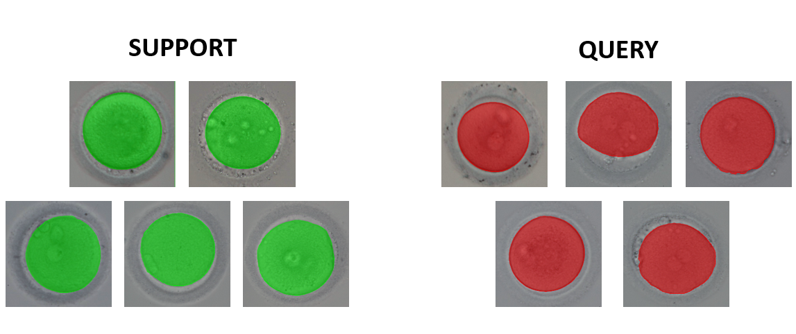
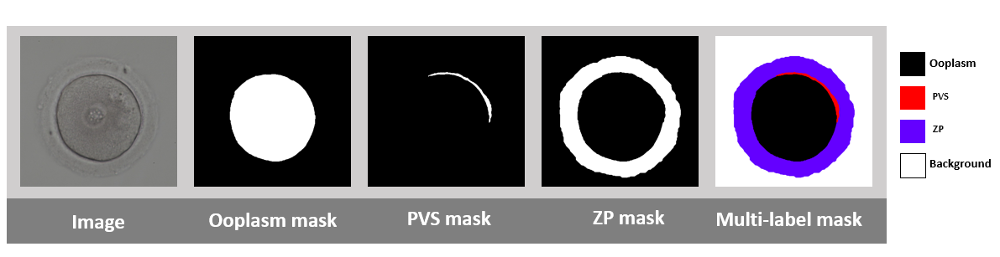

# Oocyte-FSS: Few-shot Segmentation of Oocyte MII regions



We provide a PyTorch implementation of a relation network for binary and multi-class segmentation.

## Dataset



- 1009 images of MII human Oocyte [download here](link)
- plus binary and multi-label masks of each image

## Getting Started
### Training
First rewrite ```def generate_dataset_folder_structure()``` in ```train.py```, then run

```
python train.py
```
### Testing
After defining the directory of support and query set, run

```
python test.py
```
